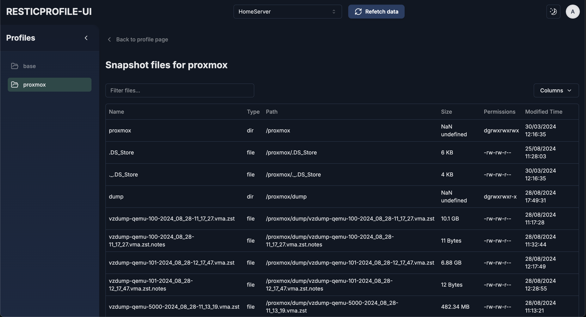

# resticprofile-ui

[](./assets/resticprofile-ui-screenshot.png)

resticprofile-ui is a web-based interface designed to make managing and monitoring your [resticprofile](https://github.com/creativeprojects/resticprofile) configs easy. It provides a convenient way to handle configurations spread across different remote servers, all in one place.

## About

This project was born out of a personal need to manage multiple resticprofile configurations across different servers in a unified way. It's a work in progress, developed to improve my own experience with resticprofile. Please note that this is not an official resticprofile tool and does not come with any guarantees for maintenance or support. Feel free to fork and modify the project as needed.

A sincere thank you to the [resticprofile](https://github.com/creativeprojects/resticprofile) maintainers for their amazing work—I absolutely love this tool!

## Features

- View resticprofile configurations from remote servers
- Explore snapshots and schedulers
- (Upcoming) Download snapshots directly from the UI

## Installation and Usage

### Standalone (Running the Next.js app directly)

1. Clone the repository:
   ```
   git clone https://github.com/your-username/resticprofile-ui.git
   cd resticprofile-ui
   ```
2. Install dependencies:
   ```
   npm install
   ```
3. Set up your environment variables by copying the `.env.example` file to `.env` and filling in the necessary values.
4. Run the development server:
   ```
   npm run dev
   ```
5. Open `http://localhost:3000` in your browser.

### Using Docker Compose

1. Prerequisites:

- Docker and Docker Compose: Ensure you have Docker and Docker Compose installed on your system
- User with UID/GID 1000: The Docker image assumes the existence of a user with UID (User ID) and GID (Group ID) 1000 on your host system. This is typically the node user.

2. Prepare your environment

   - Create a `.env` file in the same directory with the following content:

     ```
     AUTH_SECRET=your_secret_here
     DB_PATH=./data
     PUBLIC_SITE_TITLE=ResticProfile UI
     PORT=3000
     ```

     Adjust the values as needed.

   - Data directory:
     - If you don't have a ./data directory, create it.
     - Ensure the ./data directory is owned by the user with UID/GID 1000:
     ```
     mkdir data
     sudo chown -R 1000:1000 data
     ```

3. Make sure your `docker-compose.yml` looks like this:

   ```yaml
   services:
     resticprofile-ui:
       image: militu/resticprofile-ui:latest
       build: .
       volumes:
         - ${DB_PATH:-./data}:/app/data
         - ${HOME}/.ssh:/home/node/.ssh:ro
       environment:
         - AUTH_SECRET=${AUTH_SECRET:?err}
         - PUBLIC_SITE_TITLE=${PUBLIC_SITE_TITLE:-resticprofile-ui}
       ports:
         - "${PORT:-3000}:3000"
       restart: unless-stopped
   ```

4. Run the Docker Compose stack:
   ```
   docker-compose up -d
   ```

## Important Notes

- Authentication: The `AUTH_SECRET` variable in your `.env` file is required for secure authentication. Generate a strong, random secret and keep it confidential.

- Troubleshooting:

  - If you encounter permission errors, double-check the ownership and permissions of the `./data` directory and your SSH keys directory.
  - If you don't have a user with UID/GID 1000, you can either create one or adjust the ownership of the ./data directory to match your user's UID/GID.

## Contributing

This is a personal project, so there are no strict guidelines. Feel free to fork it, make changes, or provide feedback!

## Disclaimer

This project is unofficial and provided as-is, without warranties or guarantees. Use it at your own risk.

## License

[MIT License](LICENSE)
